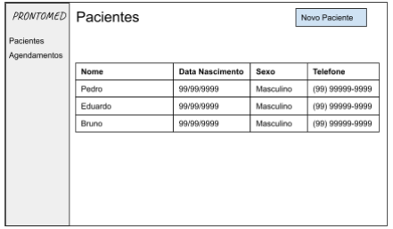
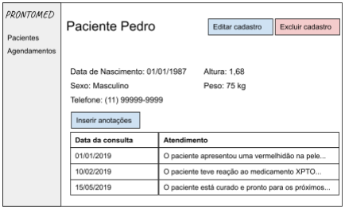
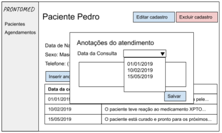
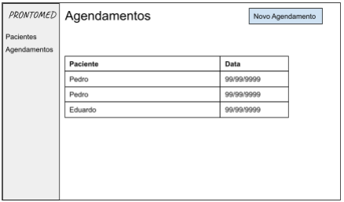
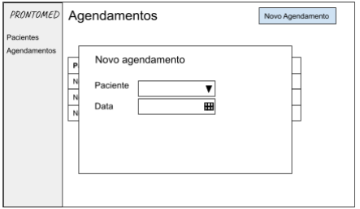
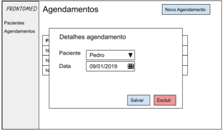
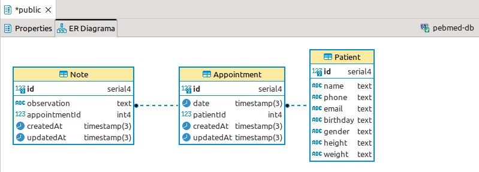

<p align="center">
  </a>
</p>

<div id="top"></div>

# Desafio backend

Construir o backend para um sistema de prontuário eletrônico onde o médico pode cadastrar as informações do paciente como nome, telefone, data de nascimento, sexo, altura e peso e fazer os registros das consultas realizadas por paciente.

## 1. Requisitos funcionais

**Requisitos obrigatórios**
● Eu, como médico, quero poder cadastrar um paciente com os seguintes dados:
nome, telefone, email, data de nascimento, sexo, altura e peso.
● Eu, como médico, quero poder listar e editar o perfil dos pacientes cadastrados.
● Eu, como médico, quero poder cadastrar um agendamento de consulta para um
paciente.
● Eu, como médico, quero poder listar, alterar e excluir os agendamentos de consulta.
● Eu, como médico, quero poder anotar uma observação durante a consulta.
● Eu, como médico, quero poder visualizar as anotações das consultas dos pacientes.

**Requisitos desejáveis**
● Eu como médico, quero que o sistema valide a minha agenda, não deixando eu
cadastrar mais de um paciente na mesma hora.
● Eu, como médico, quero poder excluir os dados pessoais do paciente por causa das
novas regras do LGPD, mas mantendo o histórico de consulta por questões de
contabilidade.

### Wireframes (Feito por Dev para Devs😎)

<p align="center">
  </a>
</p>

<p align="center">
  </a>
</p>

<p align="center">
  </a>
</p>

<p align="center">
  </a>
</p>

<p align="center">
  </a>
</p>

<p align="center">
  </a>
</p>

Obs: Não é necessário seguir 100% os wireframes, eles servem mais para ajudar a ter uma
visão global de uma possível solução e para servir de guia.

## 2. Requisitos não funcionais

### Requisitos obrigatórios

- Deve usar o padrão de API REST (HTTP/JSON);
- Pode ser feito em node.js (javascript ou typescript) ou PHP (laravel);
- Documentação da interface da API gerada (swagger, open-api, RAML ou postman);
- Os dados devem ser validados (existência e formatos) na inserção/atualização para
garantir consistência da base;
- Implementar testes unitários e/ou de integração e/ou documentação de testes (casos
de teste / script de teste);

### Requisitos desejáveis

- Documentação da modelagem do banco de dados (diagrama ER ou de classe);
- Para o banco de dados pode usar MySQL ou PostgreSQL, podendo optar ou não
pelo uso de ORM;
- Setup de ambiente de desenvolvimento usando docker / docker-compose;
- Hospedar em um ambiente cloud a sua escolha (Heroku, AWS EBS, IBM Cloud, etc)
- Garantir autenticação e/ou autorização (login/logout, token JWT, roles)
- Implementar alguma ferramenta de lint ou qualidade (sonar, code-quality, eslint, etc)
- Deploy automatizado via pipeline (gitlab-ci, bitbucket pipeline, github actions, etc)

## 3. O que deverá ser entregue

- As instruções de como rodar o projeto (use o readme.md);
- Qualquer artefato que seja relevante para a execução do projeto como arquivos, scripts
de banco, informações de conexão com o banco e etc (também no readme);
- O projeto deve ser hospedado no git (bitbucket, github, gitlab, etc) para ser avaliado;

## 4. Itens que serão avaliados

- Funcional (alcançou os requisitos propostos?);
- Não funcional (alcançou os requisitos propostos?);
- Utilização de boas práticas (princípios SOLID, code-smells, etc);
- Estrutura e organização (componentização, uso de camadas, etc);
- Legibilidade do código (nomenclatura de classes, métodos e variáveis, lint, etc);
- Implementação de testes que garantam que o código está atendendo os requisitos;
- Documentação (histórico de commits no git, readme, diagramas);

## :truck: Entregáveis

<p align="center">
  <a href="#rocket-tecnologies">Tecnologia</a>&nbsp;&nbsp;&nbsp;|&nbsp;&nbsp;&nbsp;
  <a href="#project">Projeto</a>&nbsp;&nbsp;&nbsp;|&nbsp;&nbsp;&nbsp;
  <a href="#layout">Layout</a>&nbsp;&nbsp;&nbsp;|&nbsp;&nbsp;&nbsp;
  <a href="#construction-roadmap">Roadmap</a>&nbsp;&nbsp;&nbsp;|&nbsp;&nbsp;&nbsp;
  <a href="#how-to-contribure">Como contribuir</a>&nbsp;&nbsp;&nbsp;|&nbsp;&nbsp;&nbsp;
  <a href="#memo-license">Licença</a>
</p>

## :rocket: Tecnologia

Você irá usar as seguintes ferramentas para construir sua aplicação:

- [![Nest][NestJS]][Nest-url] NestJS as the backend framework
- [![PostgreSQL][PostgreSQL]][PostgreSQL-url] PostgreSQL as the database
- [![Prisma][Prisma]][Prisma-url] Prisma as the Object-Relational Mapper (ORM)
- [![Swagger][Swagger]][Swagger-url] Swagger as the API documentation tool
- [![TypeScript][TypeScript.org]][TypeScript-url] TypeScript as the programming language

## 💻 Projeto

Construir o backend para um sistema de prontuário eletrônico onde o médico pode cadastrar as informações do paciente como nome, telefone, data de nascimento, sexo, altura e peso e fazer os registros das consultas realizadas por paciente.

## 🔖 Layout

Conforme Wireframes descritos na especificação do desafio.

## :construction: Roadmap

1. Requisitos Obrigatórios:

- [x] Deve usar o padrão de API REST (HTTP/JSON);
- [x] Pode ser feito em node.js (javascript ou typescript) ou PHP (laravel);
- [x] Documentação da interface da API gerada (swagger, open-api, RAML ou postman);
- [x] Os dados devem ser validados (existência e formatos) na inserção/atualização para
garantir consistência da base;
- [x] Implementar testes unitários e/ou de integração e/ou documentação de testes (casos
de teste / script de teste);

>Detalhes

- [x] Criado API's (com NestJS)
- [x] Criado documentação das API's (com Swagger)
- [x] Adicionado Testes E2E (com Jest)
- [ ] Adicionado Testes Unitários (com Jest)

2. Requisitos Desejáveis:

- [x] Documentação da modelagem do banco de dados (diagrama ER ou de classe);
- [x] Para o banco de dados pode usar MySQL ou PostgreSQL, podendo optar ou não
pelo uso de ORM;
- [x] Setup de ambiente de desenvolvimento usando docker / docker-compose;
- [x] Hospedar em um ambiente cloud a sua escolha (Heroku, AWS EBS, IBM Cloud, etc)
- [ ] Garantir autenticação e/ou autorização (login/logout, token JWT, roles)
- [x] Implementar alguma ferramenta de lint ou qualidade (sonar, code-quality, eslint, etc)
- [x] Deploy automatizado via pipeline (gitlab-ci, bitbucket pipeline, github actions, etc)

>Detalhes

- [x] Criado Database (com PostgreSQL e Docker)
- [x] Criado ER Diagram (com DBeaver)
- [x] Adicionado Deploy Heroku (deploy com github actions [build e test])
- [x] Implementado Eslint como ferramenta de qualidade de código (padrão Nest)

### :checkered_flag: Preview Project

- [![Heroku-server][Heroku-server]][Heroku-server-url]

## 🤔 Como contribuir

- Faça uma fork desse repositório;
- Crie uma branch com sua feature: `git checkout -b <my feature>`;
- Faça commit de suas atualizações: `git commit -m 'feat: <my feature>'`;
- Faça push para a sua branch: `git push origin <my feature>`.

Depois, realize o merging do seu código, você pode deletar sua branch.

## :memo: Licença

MIT Licença. Veja `LICENSE.txt` para mais informação.

## Para rodar o projeto

### Requerimentos

- [Node.js](https://nodejs.org/en/)
- [Npm](https://www.npmjs.com/)
- [Docker](https://www.docker.com/)

### Instalação

#### Clone o projeto e acesso o diretório

```bash
git clone https://github.com/wellyssongodinho/pebmed-server.git
```

#### Crie uma instância do PostgreSQL

Você irá usar PostgreSQL como o banco de dados para a sua aplicação NestJS. Esse tutorial mostrará como instalar PostgreSQL via Docker container.

> Nota: Se você não quiser utilizar Docker, poderá configurar uma instância local do PostgreSQL ou hospedá-la diretamente no Heroku.

Avalie o arquivo docker-compose.yml no diretório principal do projeto.

Esse arquivo `docker-compose.yml` contém as especificações necessárias para rodar uma instância local do PostgreSQL via docker container:

```bash
version: "3.8"
services:
  postgres:
    image: postgres:latest
    restart: always
    environment:
      - POSTGRES_USER=postgres
      - POSTGRES_PASSWORD=postgres
    ports:
      - "5432:5432"
    volumes:
      - postgres:/var/lib/postgresql/data
volumes:
  postgres:
```

Algumas definições para ajudar na compreensão:

A opção `image` define a imagem que será utilizada no container Docker. Aqui, nós estamos utilizando a última versão do `postgres`.
A opção `environment` determina algumas variáveis que serão passadas durante a inicialização do container. Você poderá definir outras opções de configuração e credenciais – como username e password.
A opção `volumes` é usado para persistir o local do file system de armazenamento do container.
A opção `ports` mapeia as portas de acesso ao ambiente do Postgres no container. O formato segue a convenção `'host_port:container_port'`. Neste caso, estamos definindo apenas a porta 5432 do PostgreSQL container, pois é a porta padrão.

Certifique-se de que nada esteja rodando na porta `5432` em sua máquina. Para iniciar o postgres container, abra o terminal e rode o seguinte comando no diretório principal do seu projeto:

```bash
docker-compose up -d
```

Se todas as coisas estiverem certas, o novo terminal estará pronto para aceitar sua conexão com o banco. Você deve ver uns logs similar ao seguinte:

```bash
...
❯ docker-compose up -d
[+] Running 2/2
 ⠿ Network pebmed-server_default       Created                                                                                                                                                    0.1s
 ⠿ Container pebmed-server-postgres-1  Started  
```

Parabéns 🎉. Você agora tem seu próprio banco de dados PostgreSQL!

Para facilitar, adicionamos o seguinte comando em seu arquivo package.json.

```bash
>package.json
    "db:up": "docker-compose up -d",
    "db:down": "docker-compose down"
```

Com isso, você também poderá utilizar o seguinte comando para subir o container do PostgreSQL:

```bash
//subir o container
$ npm run db:up

//dropar o container
$ npm run db:down 
```

### ER Digagrama

Diagrama de Entidade e Relacionamento das tabelas que serão geradas no seu banco de dados:
<p align="center">
  </a>
</p>

### Instalando a aplicação

```bash
//
$ npm install
```

### Rodando a aplicação

```bash
# development
$ npm run start

# watch mode
$ npm run start:dev

# production mode
$ npm run start:prod
```

### Testando a aplicação

```bash
# unit tests
$ npm run test

# e2e tests
$ npm run test:e2e

# test coverage
$ npm run test:cov
[to do]
```

<p align="right">(<a href="#top">back to top</a>)</p>

<h1 id="autor">Autor</h1>

- [![Linkedin][Linkedin]][Linkedin-url]
- [![Gmail][Gmail]][Gmail-url]

<p align="center">
  <a href="http://nestjs.com/" target="blank"></a>
</p>

**<p align="center">NestJS</p>**

<p align="center">A progressive <a href="http://nodejs.org" target="_blank">Node.js</a> framework for building efficient and scalable server-side applications.</p>

## Support NestJS

Nest is an MIT-licensed open source project. It can grow thanks to the sponsors and support by the amazing backers. If you'd like to join them, please [read more here](https://docs.nestjs.com/support).


[Gmail]: https://img.shields.io/badge/-wellysson.gomes@gmail.com-c14438?style=flat-square&logo=Gmail&logoColor=white&link=mailto:wellysson.gomes@gmail.com
[Gmail-url]: mailto:wellysson.gomes@gmail.com

[Heroku-server]: https://img.shields.io/badge/Heroku-430098?style=for-the-badge&logo=heroku&logoColor=white
[Heroku-server-url]: https://pebmed-server.herokuapp.com/api

[Linkedin]: https://img.shields.io/badge/-Wellysson_Godinho-blue?style=flat-square&logo=Linkedin&logoColor=white&link=https://www.linkedin.com/in/wellyssongodinho-236170234/
[Linkedin-url]: https://linkedin.com/in/wellyssongodinho/

[NestJS]: https://img.shields.io/badge/NestJS-E0234E?style=for-the-badge&logo=NestJS&logoColor=#E0234E
[Nest-url]: https://nextjs.org

[PostgreSQL]: https://img.shields.io/badge/PostgreSQL-4169E1?style=for-the-badge&logo=PostgreSQL&logoColor=white
[PostgreSQL-url]: https://www.postgresql.org/

[Prisma]: https://img.shields.io/badge/Prisma-2D3748?style=for-the-badge&logo=prisma&logoColor=white
[Prisma-url]: https://www.prisma.io

[Swagger]: https://img.shields.io/badge/Swagger-85EA2D?style=for-the-badge&logo=Swagger&logoColor=black
[Swagger-url]: https://www.prisma.io

[TypeScript.org]: https://img.shields.io/badge/TypeScript-3178C6?style=for-the-badge&logo=typescript&logoColor=white
[TypeScript-url]: https://www.typescriptlang.org
